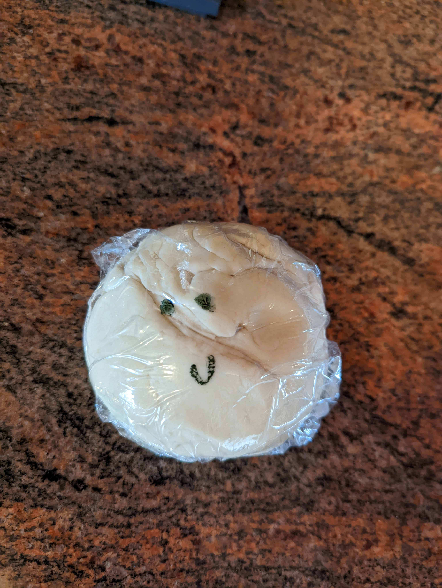
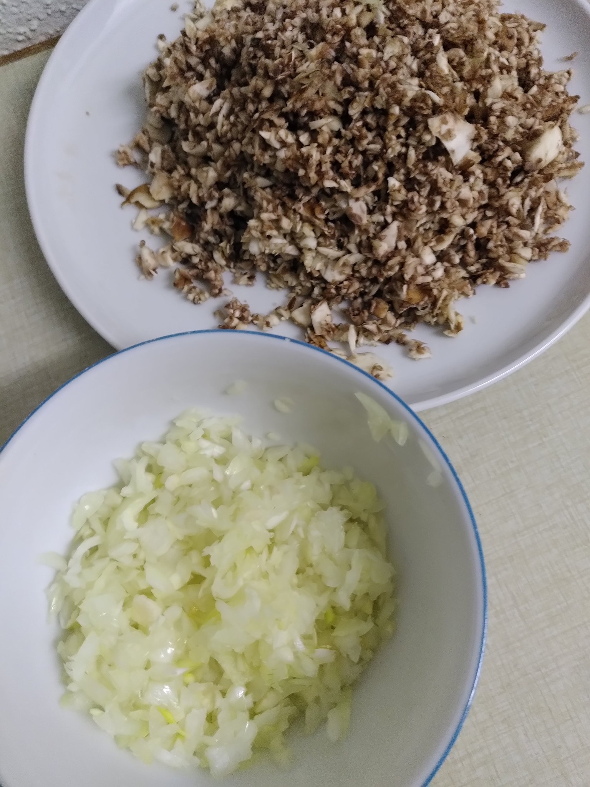
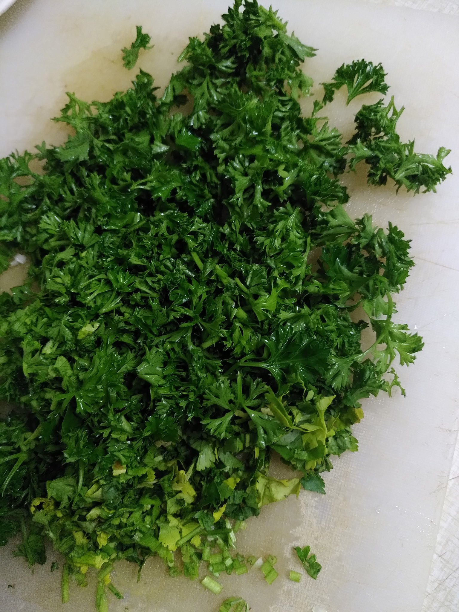
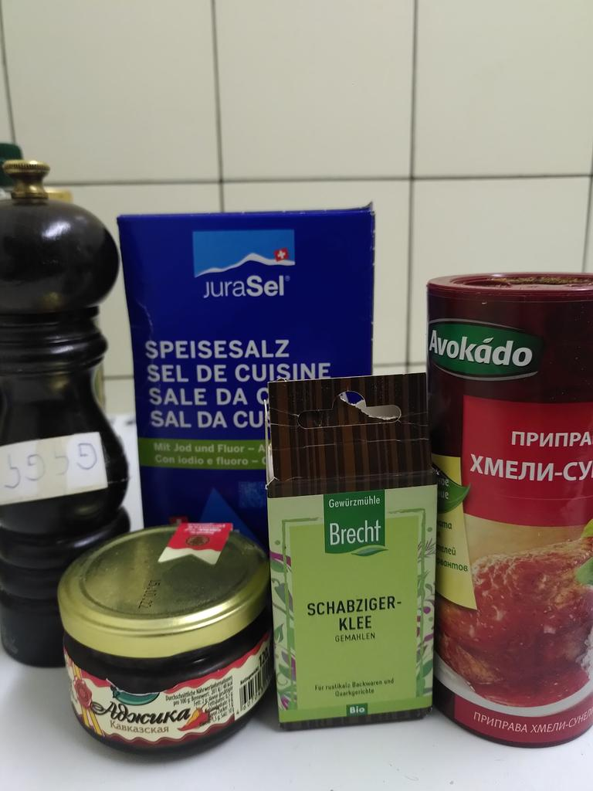
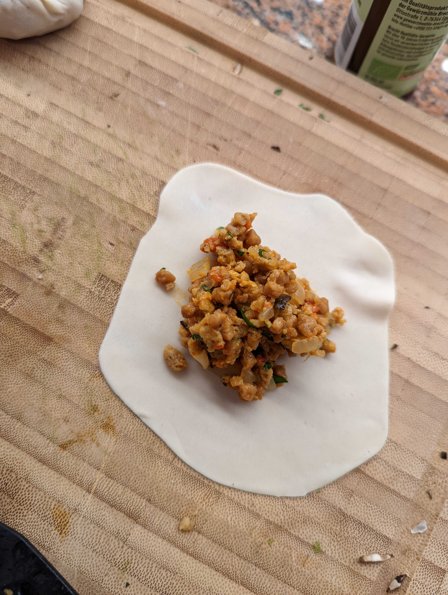
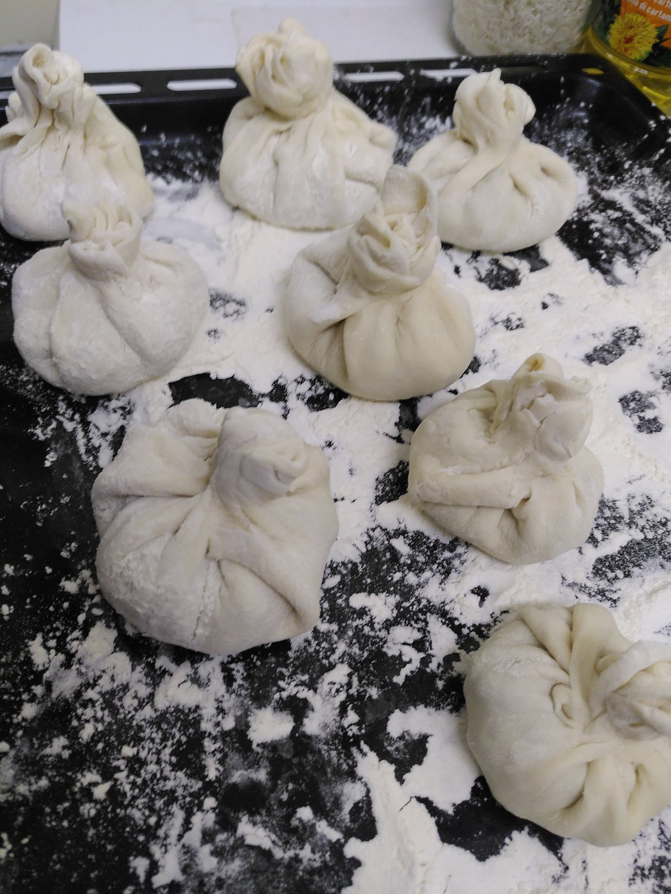
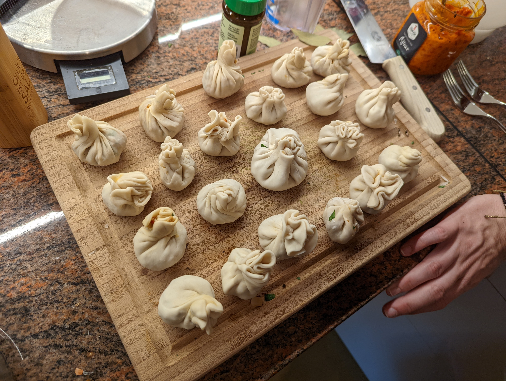
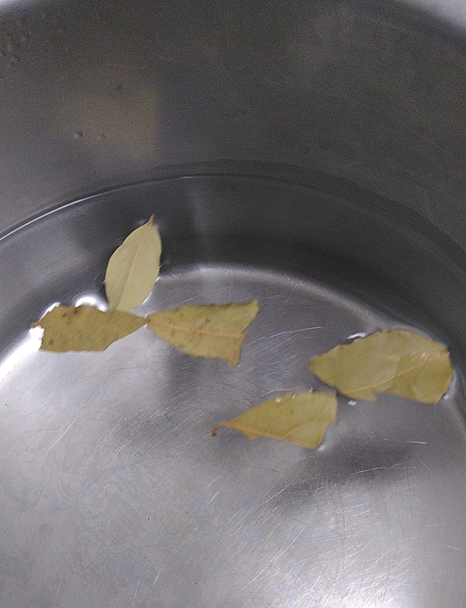
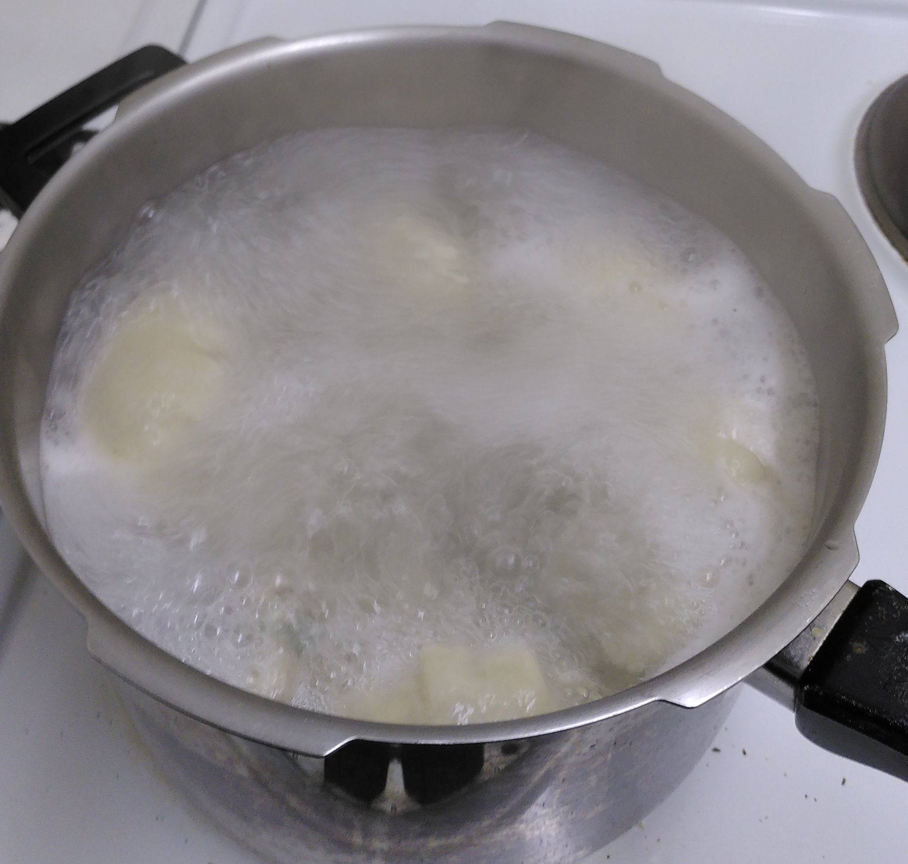

## Chinkali 🥟

Auch geschrieben xinkhali, hinkali und Khinkali
Die hier beschriebenen Mengen ergeben ca. 4 Portionen

[Twitter](https://twitter.com/BergerWthur/status/1479501532768968707) :thread:

### Zutaten 🧅🍄🥩
#### Teig
- 250g Mehl
- 1/4 TL (ca. 1.25g) Salz
- 125ml Wasser

#### Füllung
- 1 Zwiebel
- 300g Hackfleisch oder Vegi-Hack
- 100g Pilze \
(Pilz/Hackfleisch Verhältnis kann nach Belieben angepasst werden. Man kann die Pilze auch weglassen. Einfach darauf achten, dass man nicht zu wenig Teig für die Füllung hat)
- Frische Kräuter z.B Petersilie oder Koriander (oder auch nicht Koriander)
- Schabzigerklee
- Chmeli Suneli Mischung
- Adjika oder Ajvar

### Zubereitung
#### Teig
Der Teig ist eigentlich ein normaler Dumpling Teig. Darum hier ein Dumplingteig-Rezept:

1. Mehl und Salz in eine Schüssel geben und eine Mulde formen
2. Wasser in die Mulde giessen
3. Zu einem geschmeidigen Teig kneten (das dauert gut und gerne 10 Minuten) \
Der Teig wirkt am Anfang ziemlich trocken. Gebt aber nicht zu leichtfertig Wasser dazu, ansonsten ist er später nicht stark genug.
4. Teig ca. 2h in Folie gewickelt ruhen lassen \

#### Teigtaschen

1. Pilze und Zwiebeln fein schneiden \

2. Kräuter hacken \

3. Pilze und Zwiebeln anbraten
4. Nach eigenem Gusto würzen \

5. Teig 2-3mm dünn ausrollen und kreisrund ausstechen
6. Füllung verteilen und beim Zusammenfalten oben einen Zipfel drehen \

7. Lorbeerblätter in Wasser geben und zum Kochen bringen \

8. Teigtaschen ins Wasser geben, sobald sie oben aufschwimmen sind sie fertig. \

### Credits 🫶
Bilder teils von @balzamas geklaut
Rezept von @balzamas