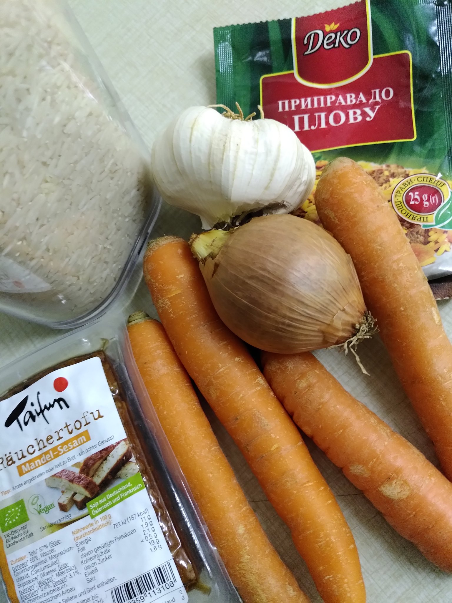
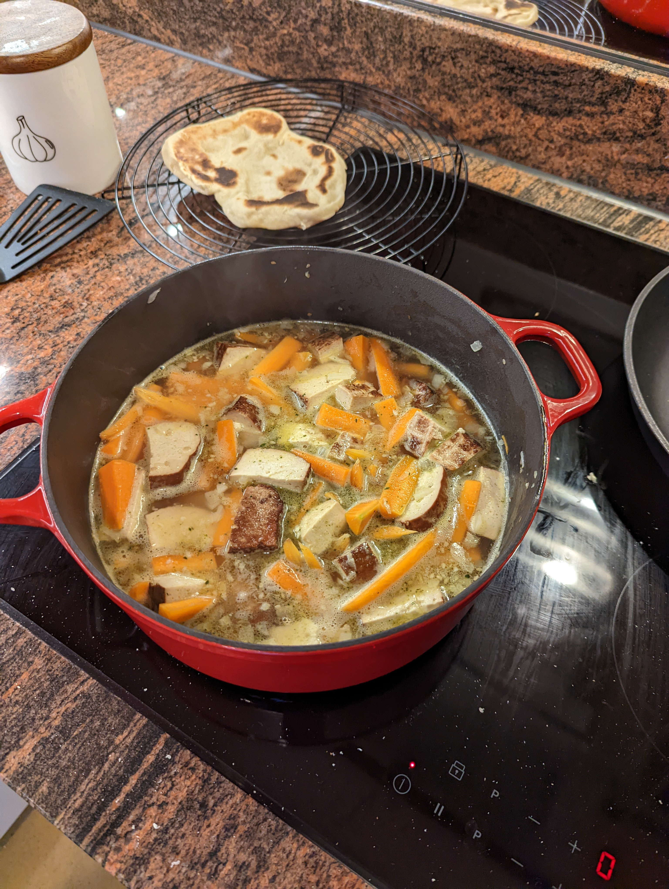
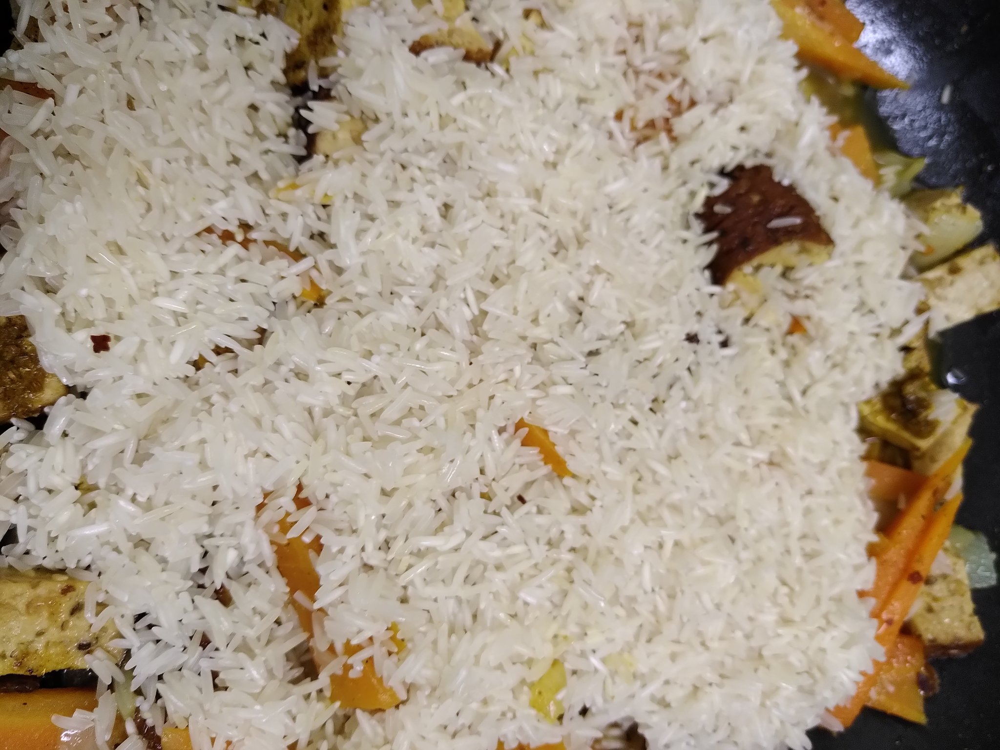

## Usbekischer Tofu-Plow 🍲

Vorbereitungszeit 10 Minuten	

Zubereitungszeit 1 Stunde	

Arbeitszeit 1 Stunde 10 Minuten	

Portionen: 4 Personen

[Twitter](https://twitter.com/BergerWthur/status/1491118584751624194) :thread:

### Zutaten

    500 gr Tofu 1x Tofu Rosso, 1x Tofu geräuchert
    500 gr Rüebli
    1 Zwiebel
    0,75 Liter Bouillon
    300 gr Reis
    3 Knoblauchzehen
    Peterli und/oder Koriander
    Pfeffer, Paprika, Kurkuma

### Anleitung

1. Knoblauch und Zwiebel zerhacken 
2. Tofu in Würfel schneiden
3. Rüebli in Stiftchen schneiden \

4. Öl erhitzen, Zwiebeln, Knoblauch und Tofu anbraten (ca. 5 Minuten) \

5. Tasse Bouillon und die Rüebli hinzufügen, bei milder Hitze 30 Minuten dünsten \

6. Reis darüber geben, nicht mischen und 5 Minuten mitdünsten \

7. Restliche Bouillon hinzufügen und fertig garen bis der Reis gut ist. 

8. Würzen mit Pfeffer, Paprika, Kurkuma, Kräuter hinzufügen und abschmecken \

### Rezept-Anmerkungen

Anstatt Tofu kann auch Hammel, Huhn oder Schwein genommen werden.

Dazu passend ein Fladenbrot wie z.B Naan
